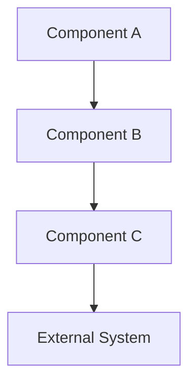
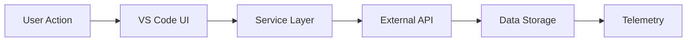
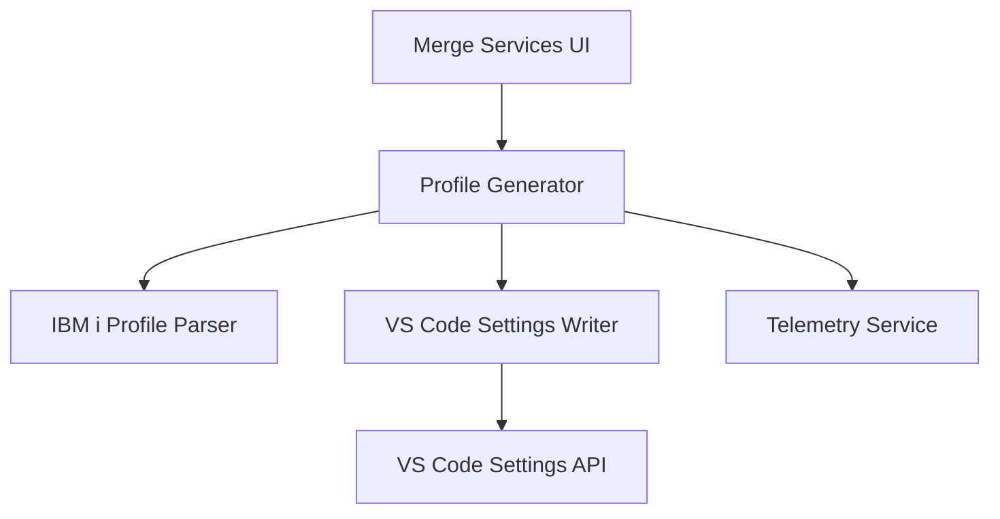

# Planning Framework & Templates

Comprehensive guide for creating implementation plans, estimating effort, and structuring technical work for GitHub issues.

## When to Create an Implementation Plan

Create a detailed plan when:

- Issue is **Medium or larger** (>8 hours estimated effort)
- Issue has **architectural impact** (affects multiple components or systems)
- Issue requires **cross-team coordination** or dependencies
- Issue involves **security, performance, or data integrity** concerns
- Issue is **user-facing** and requires UX considerations
- Stakeholders need **timeline commitments** or progress tracking

**Do NOT over-plan** for:
- Simple bug fixes (<4 hours)
- Trivial enhancements or documentation updates
- Well-understood, low-risk changes
- Internal refactoring with no external impact

---

## Implementation Plan Template

Use this template for Medium to XL complexity issues:

````markdown
# Implementation Plan

## Overview
[1-2 sentence summary of what will be implemented and why]

## Success Criteria
- [ ] [Measurable outcome 1]
- [ ] [Measurable outcome 2]
- [ ] [Measurable outcome 3]

## Architecture & Design

### Current State
[Brief description of how things work today]

### Proposed State
[Brief description of how things will work after implementation]

### Component Diagram


### Data Flow


### Key Design Decisions
1. **Decision**: [What was decided]
   - **Rationale**: [Why this approach]
   - **Alternatives Considered**: [Other options and why rejected]

2. **Decision**: [What was decided]
   - **Rationale**: [Why this approach]
   - **Alternatives Considered**: [Other options and why rejected]

## Acceptance Criteria

### Must Have (P0)
- [ ] [Critical requirement 1]
- [ ] [Critical requirement 2]
- [ ] [Critical requirement 3]

### Should Have (P1)
- [ ] [Important but not blocking requirement 1]
- [ ] [Important but not blocking requirement 2]

### Nice to Have (P2)
- [ ] [Enhancement if time permits]
- [ ] [Enhancement if time permits]

## Implementation Phases

### Phase 1: Foundation (X hours)
**Goal**: [What this phase accomplishes]

**Tasks**:
1. [Task 1] - Xh
2. [Task 2] - Yh
3. [Task 3] - Zh

**Deliverables**:
- [Deliverable 1]
- [Deliverable 2]

**Dependencies**: [None / List dependencies]

---

### Phase 2: Core Implementation (Y hours)
**Goal**: [What this phase accomplishes]

**Tasks**:
1. [Task 1] - Xh
2. [Task 2] - Yh
3. [Task 3] - Zh

**Deliverables**:
- [Deliverable 1]
- [Deliverable 2]

**Dependencies**: Phase 1 complete

---

### Phase 3: Integration & Testing (Z hours)
**Goal**: [What this phase accomplishes]

**Tasks**:
1. [Task 1] - Xh
2. [Task 2] - Yh
3. [Task 3] - Zh

**Deliverables**:
- [Deliverable 1]
- [Deliverable 2]

**Dependencies**: Phase 2 complete

---

### Phase 4: Documentation & Release (W hours)
**Goal**: [What this phase accomplishes]

**Tasks**:
1. Update README.md - 1h
2. Update docs/ - 1h
3. Add JSDoc comments - 1h
4. Update CHANGELOG.md - 0.5h
5. Create release notes - 0.5h

**Deliverables**:
- Complete documentation
- Release notes
- Updated changelog

**Dependencies**: Phase 3 complete

## Effort Estimation

| Phase | Tasks | Hours | Days |
|-------|-------|-------|------|
| Phase 1: Foundation | 3 tasks | Xh | X/8 days |
| Phase 2: Core Implementation | 5 tasks | Yh | Y/8 days |
| Phase 3: Integration & Testing | 4 tasks | Zh | Z/8 days |
| Phase 4: Documentation & Release | 5 tasks | Wh | W/8 days |
| **Total** | **N tasks** | **Th** | **T/8 days** |

**Confidence**: [High / Medium / Low]

**Assumptions**:
- [Assumption 1]
- [Assumption 2]
- [Assumption 3]

**Risks & Contingencies**:
- **Risk**: [Potential issue]
  - **Impact**: [How it affects timeline/scope]
  - **Mitigation**: [How to address or work around]
  - **Contingency**: [Buffer time or fallback plan]

## Testing Strategy

### Unit Tests
- [ ] Test component A with mocked dependencies
- [ ] Test component B edge cases
- [ ] Test error handling scenarios

**Coverage Target**: ≥80% for new code

---

### Integration Tests
- [ ] Test end-to-end workflow
- [ ] Test interaction with external API
- [ ] Test data persistence and retrieval

**Coverage Target**: ≥70% for integration paths

---

### Manual Testing
- [ ] Test on Windows 10/11
- [ ] Test on macOS (Intel and ARM)
- [ ] Test on Linux (Ubuntu)
- [ ] Test with slow network conditions
- [ ] Test with GitLab sandbox environment

**Test Matrix**: Cross-platform + edge cases

---

### Security Testing
- [ ] Verify no secrets logged
- [ ] Test authentication/authorization flows
- [ ] Validate input sanitization
- [ ] Check for injection vulnerabilities

**Security Checklist**: Follow OWASP guidelines

---

### Accessibility Testing
- [ ] Keyboard navigation functional
- [ ] Screen reader compatible
- [ ] ARIA labels present
- [ ] Color contrast meets WCAG AA

**Accessibility Checklist**: Follow WCAG 2.1 Level AA

---

### Performance Testing
- [ ] Measure API call latency
- [ ] Monitor memory usage
- [ ] Check CPU utilization
- [ ] Validate caching effectiveness

**Performance Targets**: [Specific metrics, e.g., p95 <500ms]

## Success Metrics

Define measurable outcomes to validate success:

| Metric | Target | Measurement Method |
|--------|--------|-------------------|
| Feature adoption rate | ≥30% within 1 month | Telemetry: feature usage events |
| Error rate | <1% | Telemetry: error events / total events |
| User satisfaction | ≥4.0/5.0 | User surveys |
| Performance (latency) | p95 <500ms | Telemetry: API call duration |
| Test coverage | ≥80% | Code coverage report |
| Documentation completeness | 100% public APIs documented | JSDoc coverage check |

## Rollout Plan

### Pre-Rollout
- [ ] All tests passing
- [ ] Code review approved
- [ ] Documentation updated
- [ ] Release notes prepared

### Rollout Phases
1. **Alpha (internal)**: Deploy to dev team for dogfooding (1 week)
2. **Beta (early adopters)**: Deploy to opt-in beta users (2 weeks)
3. **General Availability**: Full rollout to all users

### Monitoring
- Monitor telemetry for error spikes
- Track feature adoption metrics
- Watch for GitHub issues or user feedback
- Be prepared to hotfix or rollback if critical issues discovered

### Rollback Plan
**Trigger**: Error rate >5%, critical security issue, or data corruption detected

**Steps**:
1. Immediately publish previous VSIX version
2. Notify users via release notes
3. Create hotfix branch
4. Debug and fix issue
5. Re-test and redeploy

## Dependencies & Blockers

### Internal Dependencies
- [ ] [Component X must be implemented first - Issue #123]
- [ ] [API Y must be updated - Issue #456]

### External Dependencies
- [ ] [GitLab API feature availability - Version 18.6+]
- [ ] [IBM i host access - Test environment required]

### Known Blockers
- [ ] [Blocker description - Status/ETA]

## Open Questions

- [ ] **Question**: [Unanswered question]
  - **Context**: [Why this matters]
  - **Decision By**: [Who needs to answer and when]

- [ ] **Question**: [Unanswered question]
  - **Context**: [Why this matters]
  - **Decision By**: [Who needs to answer and when]

## Related Work

- Related Issue: #123 - [Description]
- Related PR: #456 - [Description]
- External Doc: [Link to design doc, RFC, or external spec]

## Sign-off

- [ ] **Architect Review**: [Name] - [Date]
- [ ] **Security Review**: [Name] - [Date]
- [ ] **Stakeholder Approval**: [Name] - [Date]

````

---

## Effort Estimation Guide

### Complexity Sizing

| Size | Definition | Hours | Days (8h) | Example |
|------|------------|-------|-----------|---------|
| **XS** | Trivial change, single file, no tests needed | 1-2h | <0.5d | Fix typo, update config value |
| **S** | Simple feature, few files, straightforward tests | 2-8h | 0.5-1d | Add new command, simple UI update |
| **M** | Moderate complexity, multiple components, integration tests | 8-24h | 1-3d | OAuth2 flow, profile generator |
| **L** | Complex feature, cross-system integration, extensive testing | 24-80h | 3-10d | GitLab sync engine, telemetry service |
| **XL** | Architectural change, major refactoring, migration | 80h+ | 10+d | Rewrite authentication layer, DB migration |

### Estimation Heuristics

**Base Estimation** (core implementation):
- XS: 1-2h
- S: 4-6h
- M: 12-16h
- L: 40-60h
- XL: 100-200h

**Add Time For**:
- **Testing**: +30-50% of base (more for complex integration)
- **Documentation**: +10-20% of base (README, JSDoc, user docs)
- **Code Review & Iteration**: +10-20% of base (review cycles, rework)
- **Unknowns/Risks**: +20-50% buffer for uncertainty

**Example**:
- Base: 16h (Medium complexity feature)
- Testing: +8h (50% for integration tests)
- Documentation: +3h (20% for README and JSDoc)
- Review: +3h (20% for review cycles)
- Buffer: +4h (25% for unknowns)
- **Total**: 34h (~4-5 days)

### Confidence Levels

| Confidence | Criteria | Buffer |
|------------|----------|--------|
| **High** | Well-understood problem, clear requirements, proven patterns | +20% |
| **Medium** | Some unknowns, moderate complexity, requires research | +30-50% |
| **Low** | Significant unknowns, high complexity, experimental approach | +50-100% |

---

## Risk Assessment Matrix

### Risk Categories

| Risk | Likelihood | Impact | Priority | Mitigation |
|------|------------|--------|----------|------------|
| **External API change** | Medium | High | High | Version pinning, fallback logic |
| **Cross-platform compatibility** | Medium | Medium | Medium | Test matrix, conditional logic |
| **Performance degradation** | Low | High | Medium | Profiling, benchmarks, caching |
| **Security vulnerability** | Low | Critical | Critical | Security review, penetration testing |
| **Scope creep** | High | Medium | High | Clear requirements, change control |
| **Dependency issues** | Medium | Medium | Medium | Lock files, version constraints |

### Risk Response Strategies

- **Avoid**: Change approach to eliminate risk
- **Mitigate**: Reduce likelihood or impact
- **Transfer**: Outsource or delegate risk
- **Accept**: Acknowledge and monitor risk

---

## Implementation Checklist

Use this checklist to ensure completeness:

### Before Implementation
- [ ] Requirements clearly defined and understood
- [ ] Architecture design reviewed and approved
- [ ] Effort estimated with buffer for unknowns
- [ ] Dependencies identified and addressed
- [ ] Risks assessed with mitigation plans
- [ ] Test strategy defined

### During Implementation
- [ ] Code follows project conventions and style guide
- [ ] Unit tests written for new code (≥80% coverage)
- [ ] Integration tests written for workflows
- [ ] Security considerations addressed
- [ ] Accessibility requirements met
- [ ] Performance benchmarks measured
- [ ] Code reviewed and approved
- [ ] Documentation updated (README, JSDoc, docs/)

### After Implementation
- [ ] All tests passing (unit, integration, E2E)
- [ ] Manual testing complete (cross-platform)
- [ ] Security review passed
- [ ] Performance metrics meet targets
- [ ] Documentation complete and accurate
- [ ] CHANGELOG.md updated
- [ ] Release notes prepared
- [ ] Stakeholders notified

---

## Planning Anti-Patterns

Avoid these common mistakes:

### Over-Planning
**Symptom**: 40-page design doc for 8-hour task
**Fix**: Keep plans proportional to complexity; use templates selectively

### Under-Planning
**Symptom**: "Let's just start coding and figure it out"
**Fix**: Invest in upfront design for Medium+ complexity issues

### Analysis Paralysis
**Symptom**: Endless design discussions, no progress
**Fix**: Set decision deadlines; prototype to validate assumptions

### Ignoring Risks
**Symptom**: No contingency plan, surprised by blockers
**Fix**: Explicitly identify and mitigate risks upfront

### Scope Creep
**Symptom**: Feature grows from S to XL mid-implementation
**Fix**: Define clear Must/Should/Nice-to-have boundaries; defer nice-to-haves

### No Success Metrics
**Symptom**: Can't measure if implementation succeeded
**Fix**: Define measurable outcomes before starting work

---

## Examples

### Example 1: Simple Bug Fix (Size S)

```markdown
# Implementation Plan: Fix Login Timeout

## Overview
Increase default login timeout from 10s to 30s to accommodate slow networks.

## Success Criteria
- [ ] Login succeeds for networks with 5s+ latency
- [ ] No impact on fast networks (<1s latency)

## Implementation
1. Update timeout constant in `src/auth/oauth-handler.ts` (0.5h)
2. Add unit test for timeout behavior (1h)
3. Manual test with throttled network (0.5h)
4. Update documentation (0.5h)

**Total Effort**: 2.5h (XS)

## Testing
- Unit: Mock slow API response, verify timeout respected
- Manual: Test with Chrome DevTools network throttling

## Rollout
- Deploy in next patch release (v0.8.71)
```

---

### Example 2: Medium Complexity Feature

```markdown
# Implementation Plan: Auto-Generate VS Code Profiles from IBM i Profiles

## Overview
Add feature to Merge Services that auto-generates VS Code profiles from IBM i profile metadata, reducing onboarding time by 30%.

## Success Criteria
- [ ] Parse IBM i profiles and extract relevant metadata
- [ ] Generate valid VS Code settings JSON
- [ ] Provide UI command in Merge Services
- [ ] Success rate ≥99%

## Architecture & Design

### Component Diagram


### Key Decisions
1. **Decision**: Use VS Code Settings API for profile creation
   - **Rationale**: Native API ensures compatibility and persistence
   - **Alternatives**: Direct JSON file manipulation (brittle, error-prone)

## Acceptance Criteria

### Must Have
- [ ] Parse IBM i profiles (user, host, port, library list)
- [ ] Generate VS Code settings JSON
- [ ] Validate output against schema
- [ ] Handle parse errors gracefully

### Should Have
- [ ] Support multiple profiles
- [ ] Allow customization before generation
- [ ] Provide preview of generated settings

### Nice to Have
- [ ] Auto-sync on IBM i profile changes
- [ ] Preset templates for common configs

## Implementation Phases

### Phase 1: ProfileGenerator Service (8h)
1. Create ProfileGenerator class - 3h
2. Implement parse logic for IBM i metadata - 3h
3. Add unit tests - 2h

### Phase 2: SettingsWriter Utility (6h)
1. Create SettingsWriter class - 2h
2. Implement JSON generation with validation - 3h
3. Add unit tests - 1h

### Phase 3: UI Integration (4h)
1. Add command to Merge Services - 2h
2. Create QuickPick for profile selection - 2h

### Phase 4: Testing & Documentation (6h)
1. Integration tests - 3h
2. Manual testing (cross-platform) - 1h
3. Update README and docs/ - 2h

**Total Effort**: 24h (~3 days)

## Testing Strategy

### Unit Tests
- Test ProfileGenerator with various IBM i profile formats
- Test SettingsWriter JSON output validation
- Coverage target: ≥80%

### Integration Tests
- Test end-to-end profile generation
- Test error scenarios (invalid profile, API failure)

### Manual Testing
- Test on Windows, macOS, Linux
- Test with different IBM i profile configurations

## Success Metrics
- Profile generation success rate: ≥99%
- User onboarding time reduced: 30% (baseline: 20min → target: 14min)
- Feature adoption: ≥40% within 1 month

## Rollout
- Alpha: Internal testing (1 week)
- Beta: Opt-in early adopters (2 weeks)
- GA: v0.9.0 release

## Dependencies
- VS Code Settings API
- IBM i profile metadata format (documented in docs/ibmi/)

## Risks
- **Risk**: IBM i profile format varies across environments
  - **Mitigation**: Support common formats, add extensibility for custom parsers
  - **Contingency**: +4h buffer for format variations
```

---

## Tips for Effective Planning

1. **Start Simple**: Use the full template only for Medium+ complexity
2. **Think in Phases**: Break work into logical, testable increments
3. **Estimate Conservatively**: Round up to account for unknowns
4. **Define Success**: Set measurable outcomes before starting
5. **Identify Risks Early**: Address blockers upfront, not mid-implementation
6. **Document Decisions**: Explain the "why" behind design choices
7. **Keep It Alive**: Update the plan as new information emerges
8. **Review with Peers**: Get feedback before committing to implementation
9. **Link to Issues**: Cross-reference related work and dependencies
10. **Plan for Rollback**: Always have a fallback if things go wrong
