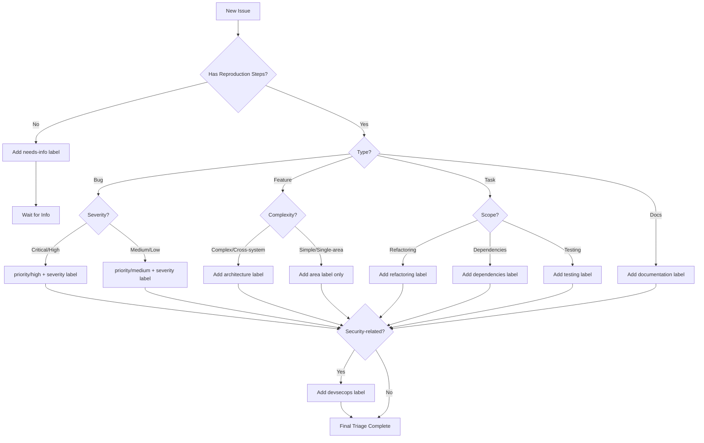

# Triage Criteria & Label Taxonomy

Comprehensive guide for categorizing, prioritizing, and labeling GitHub issues in the Lancelot VS Code extension repository.

## Issue Type Classification

### Bug
**Definition**: Something isn't working as designed or documented.

**Characteristics**:
- Reproducible failure or error
- Deviation from documented behavior
- Regression from previous working version
- Security vulnerability or data corruption

**Examples**:
- Login fails with SSO enabled
- GitLab sync throws 500 error
- VS Code crashes when opening IBM i profile
- Memory leak in telemetry service

**Required Information**:
- Steps to reproduce
- Expected vs actual behavior
- Environment (VS Code, Lancelot, OS, GitLab versions)
- Error messages or logs
- Screenshots/videos if UI-related

**Labels**: `bug`, plus severity and priority labels

---

### Feature / Enhancement
**Definition**: New capability or improvement to existing functionality.

**Characteristics**:
- Adds new user-facing or developer-facing capability
- Improves existing feature (UX, performance, reliability)
- Not fixing broken behavior, but expanding what's possible

**Examples**:
- Add dark mode support
- Auto-generate VS Code profiles from IBM i profiles
- Support GitLab 18.6 2FA authentication
- Add mermaid diagram preview in issues

**Required Information**:
- User story or problem to solve
- Proposed solution or approach
- Use cases and target users
- Acceptance criteria

**Labels**: `enhancement`, plus area labels (e.g., `ibmi`, `gitlab-integration`)

---

### Task / Chore
**Definition**: Internal work that doesn't directly add user-visible features (refactoring, dependency updates, tooling).

**Characteristics**:
- Code refactoring or cleanup
- Dependency updates
- Build/test infrastructure improvements
- Developer tooling enhancements

**Examples**:
- Refactor authentication module for testability
- Update ESLint to latest version
- Add unit tests for profile service
- Migrate from Webpack to esbuild

**Required Information**:
- What needs to be done and why
- Expected outcomes
- Impact on codebase or workflow

**Labels**: `task`, `refactoring`, `dependencies`, `testing`, or `ci-cd`

---

### Documentation
**Definition**: Updates to README, docs/, code comments, or JSDoc.

**Characteristics**:
- Adds missing documentation
- Fixes incorrect or outdated docs
- Improves clarity or examples
- Adds tutorials or guides

**Examples**:
- Document GitLab OAuth2 setup process
- Add JSDoc to ProfileService API
- Update README with new feature descriptions
- Create troubleshooting guide for IBM i connection issues

**Required Information**:
- What documentation is missing/incorrect
- Target audience (end users, developers, contributors)
- Proposed structure or content

**Labels**: `documentation`

---

### Architecture
**Definition**: Structural or design-level changes affecting system architecture.

**Characteristics**:
- Cross-component changes
- API design or redesign
- Integration patterns
- Performance or scalability improvements
- Security architecture

**Examples**:
- Redesign telemetry service for async batching
- Implement OAuth2 token refresh strategy
- Add circuit breaker for GitLab API calls
- Introduce service layer abstraction for IBM i access

**Required Information**:
- Current architecture and pain points
- Proposed design with diagrams
- Impact on existing code
- Migration strategy

**Labels**: `architecture`, plus `devsecops` if security-relevant

---

## Priority Levels

### Critical
**Response Time**: Immediate (< 4 hours)

**Criteria**:
- Production system completely down
- Data loss or corruption occurring
- Security breach or active exploit
- Critical business function blocked (e.g., payroll, customer-facing)

**Examples**:
- Extension crashes on activation for all users
- GitLab credentials exposed in logs
- Database corruption on save
- OAuth2 token leakage

**Actions**:
- Drop everything and fix immediately
- Notify team leads and stakeholders
- Create hotfix branch
- Deploy emergency patch

**Labels**: `priority/critical`, `severity/critical`

---

### High
**Response Time**: Same or next business day

**Criteria**:
- Major functionality broken but workaround exists
- Blocking workflow for significant user subset
- Security issue with no active exploit but high risk
- Regression introduced in recent release

**Examples**:
- Login times out for slow networks (workaround: retry)
- GitLab sync fails for repos >1000 files (workaround: manual sync smaller batches)
- 2FA not supported (workaround: use personal access tokens)

**Actions**:
- Prioritize in current sprint
- Assign to appropriate team member
- Create fix plan with estimate
- Communicate ETA to affected users

**Labels**: `priority/high`, plus appropriate severity label

---

### Medium
**Response Time**: 1-2 weeks

**Criteria**:
- Feature partially impaired with acceptable workaround
- Minor performance degradation
- Non-critical feature request with clear value
- Moderate technical debt

**Examples**:
- Profile auto-generation fails for edge-case IBM i configs (workaround: manual profile creation)
- GitLab API rate limiting occasionally hit (workaround: retry after delay)
- Dark mode support missing (workaround: use system theme)

**Actions**:
- Add to sprint backlog
- Estimate and schedule for upcoming sprint
- May be deprioritized if higher-priority work arises

**Labels**: `priority/medium`, plus appropriate severity label

---

### Low
**Response Time**: Backlog (no committed timeline)

**Criteria**:
- Cosmetic issues
- Nice-to-have enhancements
- Edge cases affecting <1% of users
- Minor documentation gaps

**Examples**:
- Icon alignment off by 2px
- Add keyboard shortcut for rarely-used command
- Support for legacy IBM i 7.3 (EOL)
- Tooltip text could be clearer

**Actions**:
- Add to backlog
- Consider for future releases when capacity allows
- May be closed as "won't fix" if low ROI

**Labels**: `priority/low`, plus appropriate severity label

---

## Severity Levels

Severity rates **technical impact**, independent of priority (which considers business urgency).

### Critical
**Impact**: System crash, data corruption, security vulnerability with high exploitability.

**Examples**:
- Extension crashes on startup
- SQL injection vulnerability
- Data deleted without confirmation
- Unencrypted password storage

**Labels**: `severity/critical`

---

### High
**Impact**: Core feature completely broken, significant performance degradation.

**Examples**:
- GitLab authentication fails for all OAuth2 users
- Profile generation produces invalid JSON
- Memory leak causes VS Code freeze after 2h of use

**Labels**: `severity/high`

---

### Medium
**Impact**: Partial feature impairment, minor performance degradation.

**Examples**:
- Profile auto-generation fails for 10% of IBM i profiles
- GitLab API calls 2x slower than expected (but functional)
- UI flickers during profile load

**Labels**: `severity/medium`

---

### Low
**Impact**: Cosmetic issue, documentation gap, edge case.

**Examples**:
- Button label typo
- Help text unclear
- Feature works but lacks error message for rare failure mode

**Labels**: `severity/low`

---

## Lancelot-Specific Label Taxonomy

### Component/Area Labels

| Label | Use For |
|-------|---------|
| `architecture` | Architectural design, cross-component changes, system integration |
| `devsecops` | Security, compliance, DevOps automation, CI/CD, shift-left practices |
| `ibmi` | IBM i 7.6 specific: SQLRPGLE, CLLE, DB2, jobs, profiles, SSH/FTP |
| `gitlab-integration` | GitLab 18.6 API, OAuth2, webhooks, merge requests, pipelines, issues |
| `vscode-extension` | VS Code extension API, commands, views, webviews, activation events |
| `telemetry` | Application Insights, logging, metrics, observability |
| `accessibility` | WCAG compliance, screen readers, keyboard navigation, ARIA |
| `i18n` | Internationalization, localization, translations, locale support |
| `testing` | Unit tests, integration tests, E2E tests, test infrastructure |
| `documentation` | README, docs/, JSDoc, inline comments, tutorials |
| `ui-ux` | User interface, user experience, usability, design |
| `performance` | Speed, latency, throughput, memory usage optimization |
| `security` | Authentication, authorization, encryption, secrets management |
| `ci-cd` | Continuous integration, continuous deployment, GitHub Actions |
| `dependencies` | npm packages, external libraries, SDK updates |
| `refactoring` | Code cleanup, restructuring without behavior changes |

### State Labels

| Label | Use For |
|-------|---------|
| `needs-triage` | Issue awaiting categorization, prioritization, or assignment |
| `needs-info` | Missing information required to proceed (e.g., reproduction steps) |
| `needs-investigation` | Requires research or debugging before solution approach is clear |
| `blocked` | Waiting on external dependency, decision, or other issue resolution |
| `wontfix` | Issue will not be addressed (out of scope, by design, etc.) |
| `duplicate` | Already reported in another issue (link to original) |
| `good-first-issue` | Suitable for new contributors (well-defined, small scope) |
| `help-wanted` | Community contributions welcome |

### Priority/Severity Labels

| Label | Meaning |
|-------|---------|
| `priority/critical` | Immediate attention required (< 4h response time) |
| `priority/high` | Address within 1-2 days |
| `priority/medium` | Address within 1-2 weeks |
| `priority/low` | Backlog, no committed timeline |
| `severity/critical` | System crash, data loss, high-risk security issue |
| `severity/high` | Core feature broken, significant impact |
| `severity/medium` | Partial impairment, moderate impact |
| `severity/low` | Cosmetic, edge case, minimal impact |

---

## Triage Decision Tree

Use this flowchart to guide triage decisions:

---

## Assignee Recommendations

### By Area

| Area | Suggested Assignee/Team |
|------|-------------------------|
| **IBM i integration** | @ibmi-team-lead |
| **GitLab integration** | @gitlab-integration-team |
| **VS Code extension framework** | @vscode-extension-team |
| **Authentication/Security** | @auth-team-lead, @devsecops-lead |
| **UI/UX** | @ui-team-lead |
| **Documentation** | @docs-team, open to community |
| **Testing infrastructure** | @qa-team-lead |
| **CI/CD** | @devops-team-lead |

### By Complexity

| Complexity | Suggested Assignment |
|------------|---------------------|
| **good-first-issue** | New contributors, interns, community |
| **Small/Simple** | Any team member with availability |
| **Medium** | Experienced team member in relevant area |
| **Large/Complex** | Tech lead or senior engineer |
| **Architectural** | Architect, tech lead, senior engineer with cross-team coordination |

---

## Triage Checklist

When triaging an issue, ensure the following are addressed:

- [ ] **Type**: Bug, feature, task, docs, or architecture?
- [ ] **Priority**: Critical, high, medium, or low?
- [ ] **Severity**: Critical, high, medium, or low? (if bug)
- [ ] **Labels**: All relevant area, state, and category labels applied?
- [ ] **Assignee**: Appropriate team member or team assigned?
- [ ] **Milestone**: Assigned to sprint/release milestone if prioritized?
- [ ] **Related Issues**: Linked to related issues, dependencies, or blockers?
- [ ] **Completeness**: All required information present, or `needs-info` added?
- [ ] **Duplicates**: Checked for duplicates using issue search?
- [ ] **Context**: User impact and use case understood?
- [ ] **Next Steps**: Clear path forward documented?

---

## Common Triage Scenarios

### Scenario 1: Vague Bug Report
**Issue**: "GitLab sync doesn't work"

**Triage Actions**:
1. Add `needs-info` label
2. Comment requesting:
   - Specific steps to reproduce
   - Expected vs actual behavior
   - Error messages/logs
   - Environment details
   - When did it start failing?
3. Do not assign priority/severity until info received

---

### Scenario 2: Security Vulnerability Report
**Issue**: "OAuth2 tokens visible in VS Code Output panel"

**Triage Actions**:
1. Immediately label `priority/critical`, `severity/critical`, `security`, `devsecops`
2. Assign to @auth-team-lead
3. Create private disclosure if not already reported privately
4. Notify security team
5. Do not discuss details publicly until patched
6. Add to current sprint with highest priority

---

### Scenario 3: Feature Request Without Details
**Issue**: "Add support for profiles"

**Triage Actions**:
1. Add `needs-info` label
2. Comment requesting:
   - What type of profiles? (IBM i? VS Code? User? Connection?)
   - What use case or problem does this solve?
   - Proposed user workflow
   - Acceptance criteria
3. Mark `priority/low` until clarified

---

### Scenario 4: Duplicate Issue
**Issue**: "Login fails with SSO" (already reported in #540)

**Triage Actions**:
1. Add `duplicate` label
2. Comment: "Duplicate of #540. Closing in favor of original issue."
3. Link to original issue
4. Close the duplicate issue
5. If new information, add comment to original issue

---

### Scenario 5: Enhancement with Architectural Impact
**Issue**: "Add real-time GitLab sync with webhooks"

**Triage Actions**:
1. Labels: `enhancement`, `architecture`, `gitlab-integration`, `priority/medium`
2. Assign to @gitlab-integration-team AND @architect
3. Add to backlog milestone
4. Comment suggesting initial design discussion
5. Link to related issues (e.g., existing sync logic)

---

## Tips for Effective Triage

- **Ask Questions**: When in doubt, request clarification rather than guessing
- **Search First**: Check for duplicates, related issues, or prior discussions
- **Be Specific**: Use precise labels; avoid over-labeling (max 5-7 labels per issue)
- **Update Issues**: If you gather more context during triage, update the issue body
- **Consider Impact**: Think about user impact, not just technical complexity
- **Cross-Reference**: Link to related issues, PRs, docs, or external resources
- **Document Decisions**: Add comments explaining non-obvious triage decisions
- **Iterate**: Triage is not one-time; re-triage as new information emerges

---

## When to Escalate

Escalate to tech lead or architect when:

- Issue requires cross-team coordination
- Architectural decision needed before proceeding
- Security or compliance concerns unclear
- Scope or impact significantly larger than initially thought
- Conflicting priorities or resource constraints
- Timeline commitment required for stakeholder communication
