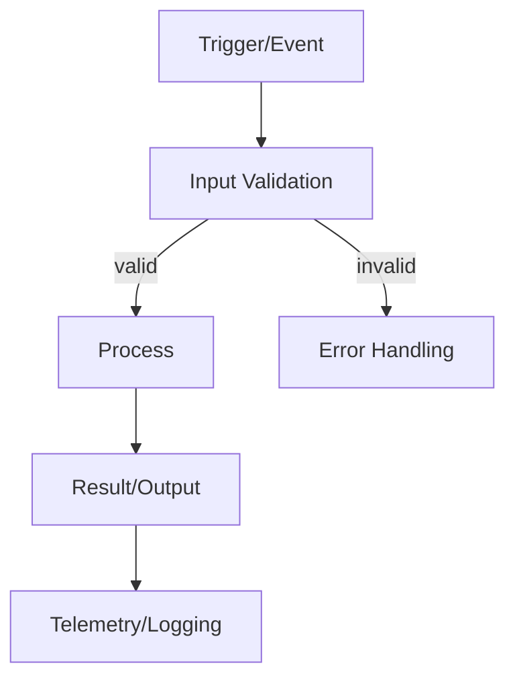
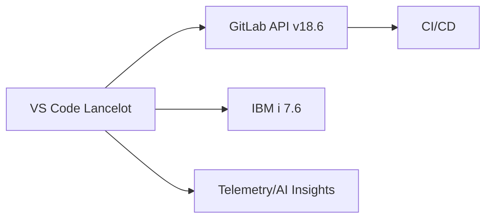

# Lancelot Comprehensive Issue Template

**Use this template only for major architectural issues, substantial features, or cross-system design decisions that require detailed planning, design review, or DevSecOps consideration.**

For routine bugs, feature requests, or tasks, use the basic templates in `templates.md` instead.

```markdown
# Problem Statement
[Concise description of the problem to solve]

# Root Cause (if known)
[Hypothesis or confirmed cause]

# Current Behavior
[What happens today]

# Expected Behavior
[What should happen]

## Logic Flow


# Impact
- Users: [Who is affected and how]
- Systems: [VS Code extension, IBM i jobs, GitLab APIs, CI/CD, etc.]
- Security/Compliance: [DevSecOps considerations]

# Architecture & Design
## Constraints & Dependencies
- [IBM i 7.6 capabilities, GitLab 18.6 APIs, VS Code API constraints, network, auth]

## Component Overview
- [Which extension services/modules are involved]

## Data Flow


# Acceptance Criteria
### Must Have
- [ ] [Criterion]

### Should Have
- [ ] [Criterion]

### Nice to Have
- [ ] [Criterion]

# Implementation Details
- [Key technical approach, patterns, security controls]

# Implementation Estimates / Estimated Effort
- Size: [S/M/L]
- Effort: [~N hours/days]

# Testing Strategy
- Unit, integration, end-to-end, IBM i validation, GitLab mock tests

# Success Metrics
- [Latency, error rate, adoption, user satisfaction, CI pass rate]

# Implementation Plan
1. [Step]
2. [Step]
3. [Step]

# Open Questions
- [Question]

# Related Issues
- #123, #456

# Labels
- architecture, devsecops, ibmi, gitlab-integration, needs-triage, priority/…, severity/…
```

## When to Use This Template

✅ **Use for:**
- Major architectural changes
- Cross-system integrations (VS Code + GitLab + IBM i)
- Security or compliance work
- Substantial features with complex design
- Performance optimization with DevSecOps impact

❌ **Don't use for:**
- Simple bugs or fixes
- Minor feature requests
- Documentation updates
- Routine maintenance tasks
