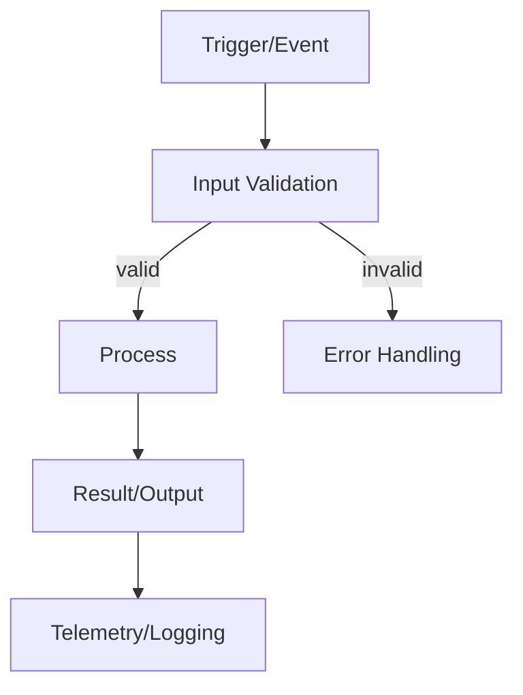
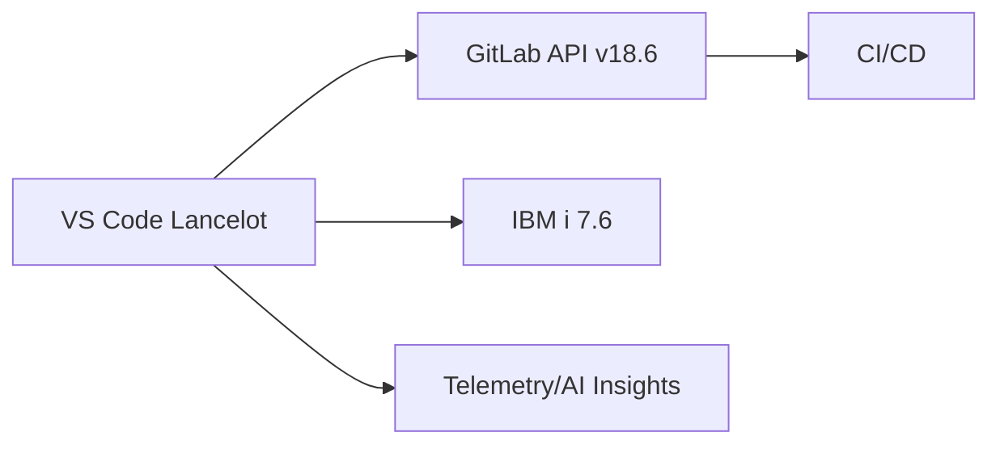

# Issue Templates

Copy and customize these templates for issue bodies.

## Comprehensive Lancelot Issue Template

Use this for Lancelot VS Code extension issues requiring architectural clarity, DevSecOps considerations, or cross-system impacts (VS Code, IBM i 7.6, GitLab 18.6).

````markdown
# Problem Statement
[Concise description of the problem to solve]

# Root Cause (if known)
[Hypothesis or confirmed cause]

# Current Behavior
[What happens today]

# Expected Behavior
[What should happen]

## Logic Flow


# Impact
- Users: [Who is affected and how]
- Systems: [VS Code extension, IBM i jobs, GitLab APIs, CI/CD, etc.]
- Security/Compliance: [DevSecOps considerations]

# Architecture & Design
## Constraints & Dependencies
- [IBM i 7.6 capabilities, GitLab 18.6 APIs, VS Code API constraints, network, auth]

## Component Overview
- [Which extension services/modules are involved]

## Data Flow


# Acceptance Criteria
### Must Have
- [ ] [Criterion]

### Should Have
- [ ] [Criterion]

### Nice to Have
- [ ] [Criterion]

# Implementation Details
- [Key technical approach, patterns, security controls]

# Implementation Estimates / Estimated Effort
- Size: [S/M/L]
- Effort: [~N hours/days]

# Testing Strategy
- Unit, integration, end-to-end, IBM i validation, GitLab mock tests

# Success Metrics
- [Latency, error rate, adoption, user satisfaction, CI pass rate]

# Implementation Plan
1. [Step]
2. [Step]
3. [Step]

# Open Questions
- [Question]

# Related Issues
- #123, #456

# Labels
- architecture, devsecops, ibmi, gitlab-integration, needs-triage, priority/…, severity/…
````

## Bug Report Template

```markdown
## Description
[Clear description of the bug]

## Steps to Reproduce
1. [First step]
2. [Second step]
3. [And so on...]

## Expected Behavior
[What should happen]

## Actual Behavior
[What actually happens]

## Environment
- Browser: [e.g., Chrome 120]
- OS: [e.g., macOS 14.0]
- Version: [e.g., v1.2.3]

## Screenshots/Logs
[If applicable]

## Additional Context
[Any other relevant information]
```

## Feature Request Template

```markdown
## Summary
[One-line description of the feature]

## Motivation
[Why is this feature needed? What problem does it solve?]

## Proposed Solution
[How should this feature work?]

## Acceptance Criteria
- [ ] [Criterion 1]
- [ ] [Criterion 2]
- [ ] [Criterion 3]

## Alternatives Considered
[Other approaches considered and why they weren't chosen]

## Additional Context
[Mockups, examples, or related issues]
```

## Task Template

```markdown
## Objective
[What needs to be accomplished]

## Details
[Detailed description of the work]

## Checklist
- [ ] [Subtask 1]
- [ ] [Subtask 2]
- [ ] [Subtask 3]

## Dependencies
[Any blockers or related work]

## Notes
[Additional context or considerations]
```

## Minimal Template

For simple issues:

```markdown
## Description
[What and why]

## Tasks
- [ ] [Task 1]
- [ ] [Task 2]
```
